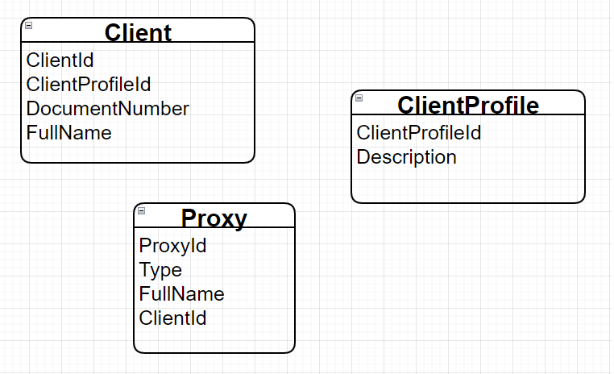
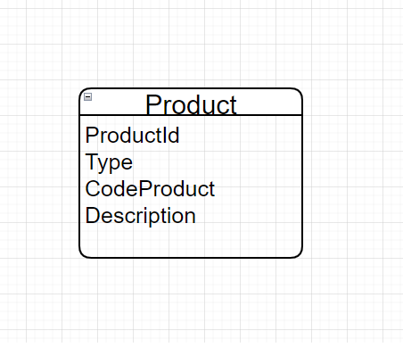
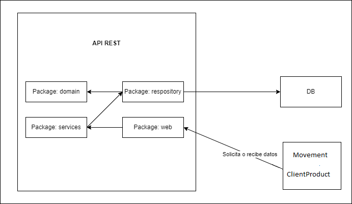
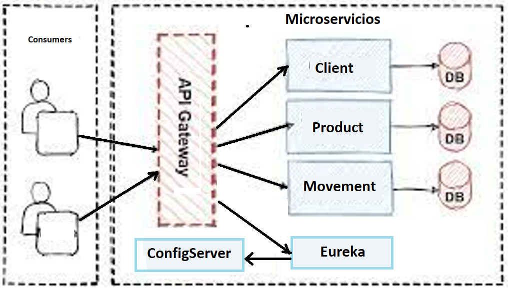
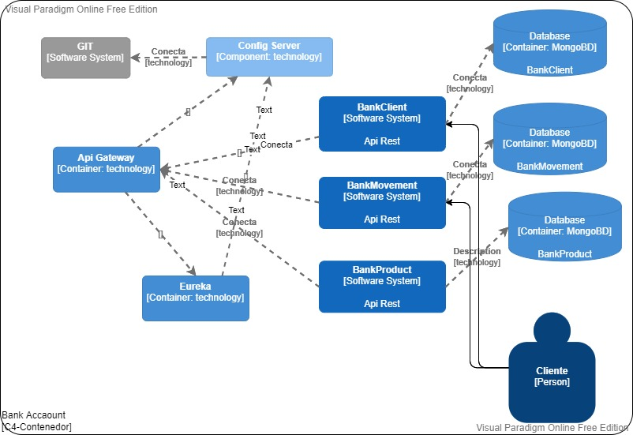
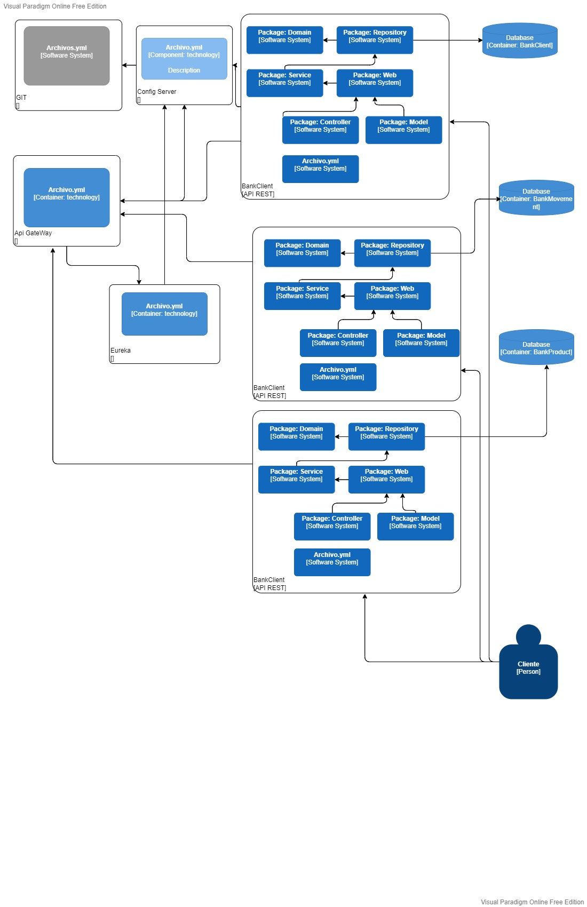

# Bank-MS

Proyecto BankAccounts

Integrantes:
Carlos Alberto Palacios Aguado
Sergio Alvarez Toledo
Bernave Daniel Inche 

Propósito del Proyecto:

- Microservicios para el manejo de las cuentas de los clientes del banco.
- El sistema está planteado en el contexto del negocio bancario que extiende las funcionalidades y requerimientos presentados en el proyecto BankAccounts.

El microservicio está basado en las transacciones de estas clases:

-LINK DEL VIDEO
https://everisgroup-my.sharepoint.com/:v:/g/personal/salvarto_emeal_nttdata_com/Eb73-iM1tnxOuUnaw8XJJ2oBoYIMaRYBaHLXi8cBDdyYHg?e=6CWzwM

Además el microservicio esta agrupado según los componentes:

Los diagramas C4 desde el más concreto hasta el más detallado:

